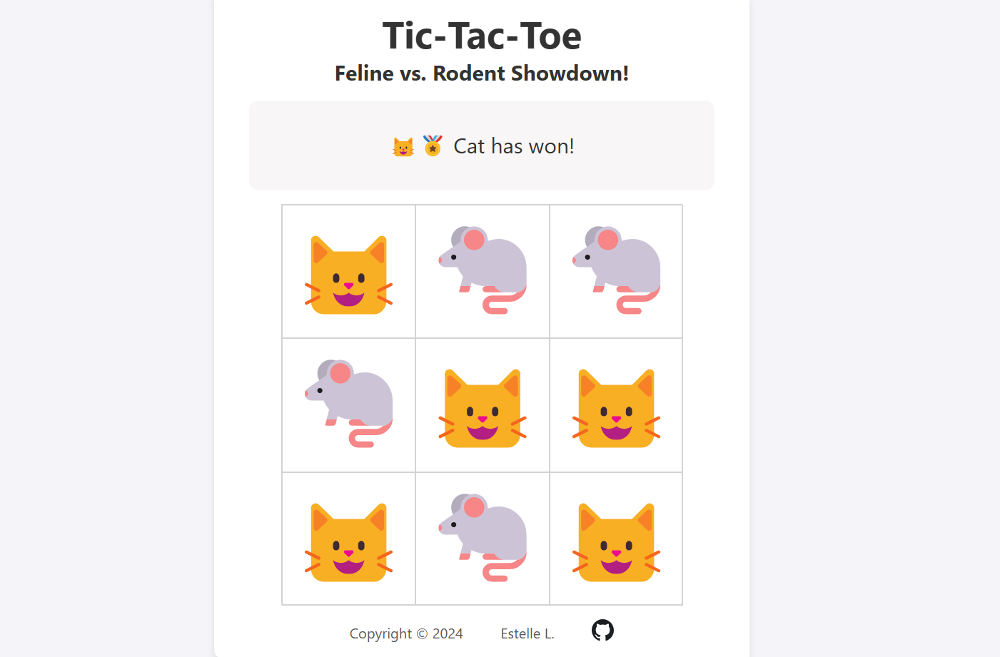

# Tic-Tac-Toe: Feline vs. Rodent Showdown!

A playful take on the classic Tic-Tac-Toe game featuring cats and mice as players. Built using HTML, CSS, and JavaScript, this project emphasizes modular programming and DOM manipulation.



🔗 **Live Demo**: [Tic-Tac-Toe Game](https://github.com/estellel-github/tic-tac-toe)

---

## Overview

### Features

- Interactive feedback highlights possible moves for a better user experience.
- Automatically identifies winners or declares a draw.
- Real-time grid updates as players make their moves.
- Responsive design.

---

## Tools Used

- **Development**: Visual Studio Code
- **Version Control**: Git and GitHub
- **Design and Layout**: CSS Grid for the game board and Flexbox for layout
- Learning materials from Odin Project curriculum (Foundations) and support from their Discord community

---

## Learning Outcomes

- Practiced **modular programming** by organizing the game logic into cohesive, reusable components.
- Enhanced skills in **DOM manipulation** to dynamically update and manage the game board.
- Implemented **event-driven design** for player interactions.
- Gained experience with **responsive layouts** using CSS Grid and Flexbox.

---

## How to Use

1. Clone the repository:
   ```bash
   git clone https://github.com/estellel-github/tic-tac-toe.git
   ```
2. Open the `index.html` file in any modern web browser.
3. Start playing! Players take turns clicking on empty squares to place their symbol.

### Game Rules

- Players alternate turns, placing their symbols (🐱 or 🐁) in empty squares.
- The first player to align three of their symbols horizontally, vertically, or diagonally wins.
- If the grid is full and no player has aligned three symbols, the game ends in a draw.
